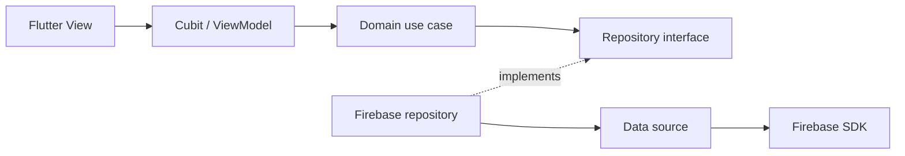

# Shattably — Home Services Marketplace

A Flutter graduation project connecting customers with skilled home-service workers.
Customers describe a job and compare offers; workers browse matching requests and
submit a price and proposed end date. Android is the supported build target.

**Flutter • Dart • Firebase • Clean Architecture • Cubit / MVVM-style • Repository Pattern • Automated Tests • GitHub Actions**

[](https://github.com/Abdallah-Gamal2003/shattably/actions/workflows/android.yml)

The portfolio version preserves the original Arabic-first UI while migrating the
four core workflows to practical Clean Architecture and Cubit-based MVVM-style
presentation. It is a learning/portfolio application, not a production marketplace.

## App preview

Real application screenshots are being prepared. The planned preview covers
authentication, service selection, request creation, worker matching, offers and
profiles. See the [capture checklist and filenames](docs/screenshots.md).

## Workflows and implemented features

**Customer:** register → verify email → sign in → choose a service → submit a
request with description, city and dates → view offers → inspect a worker profile
→ accept an eligible offer → view the accepted worker and price.

**Worker:** register with a trade and city → verify email → sign in → browse
matching available requests → submit an offer → view accepted requests → inspect
the customer's profile. The call-worker button opens the device phone app.

Both roles can reset passwords, resend verification, edit profile details and
upload a profile photo. The UI includes language selection and app sharing.
Incoming Firebase/local notifications are supported; application-generated outbound
push delivery requires a future backend.

## Architecture



Dependencies point **presentation → domain ← data**. Cubits receive use cases via
constructors, emit state, and do not access Firebase, hold Widgets/BuildContext or
navigate. Views own controllers, UI effects and routing. Repository interfaces and
entities are plain Dart. `AppDependencies` composes concrete implementations using
`RepositoryProvider`/`BlocProvider`.

Read [architecture and tradeoffs](docs/architecture.md) for concrete examples of
SRP, Dependency Inversion, Repository Pattern, MVVM responsibilities and limitations.

```text
lib/
  app/                    # Composition and authenticated role routing
  core/
    data/                 # Firebase failure translation
    errors/               # SDK-independent AppFailure
    presentation/         # Shared async state
  features/
    auth/                 # domain / data / presentation
    profile/              # domain / data / presentation
    orders/               # domain / data / presentation
    offers/               # domain / data / presentation
    home/presentation/    # Shell, service catalog, language/menu views
  components/             # Existing shared UI
  l10n/                   # Localization inputs
  main.dart
  notificationservice.dart
scripts/                  # Publication scan and compile-only CI configuration
test/                    # Unit, widget and architecture-boundary tests
docs/                    # Setup, decisions, limitations and screenshot guidance
```

## Technologies and reproducible baseline

| Area | Versions / tools |
|---|---|
| Language / SDK | Dart 3.5.4 / Flutter 3.24.4 |
| State / composition | Bloc 8.1.4, flutter_bloc 8.1.6 |
| Backend client | Firebase Auth, Cloud Firestore, Storage, Messaging |
| UI/integration | Syncfusion date picker 26.2.14, image_picker, url_launcher, share_plus, local notifications |
| Android | JDK 17, Gradle 8.9, AGP 8.7.3, Kotlin 2.1.10, compile/target SDK 35, min SDK 23 |

Dependencies are pinned in `pubspec.yaml` and `pubspec.lock`. This is a deliberate
compatibility baseline, not a claim to use the newest SDK. See
[Android baseline](docs/android-baseline.md), including signing and NDK caveats.
Syncfusion and bundled fonts/assets retain their own licensing requirements.

## Run locally

1. Install Flutter 3.24.4, JDK 17 and the Android SDK listed above.
2. Configure **your own** Firebase project using [Firebase setup](docs/firebase-setup.md).
3. Connect an Android device/emulator with Google Play services.
4. Run from the root project:

```sh
flutter pub get
flutter analyze
flutter test
flutter run
flutter build apk
```

APK output: `build/app/outputs/flutter-apk/app-release.apk`. The local release
variant currently uses debug signing; it is not a store-distribution build.

Firebase client configuration is intentionally not committed. Without local
configuration, app compilation is incomplete. There is no shared live demo account.
For **compilation only in a fresh checkout**, `python scripts/create_ci_firebase_config.py`
creates nonfunctional placeholders; these cannot sign in or access a backend and
the script refuses to overwrite existing configuration.

## Tests and CI

Latest local verification: **16 tests passed; zero analyzer errors or warnings;
Android release APK built successfully**. There are 29 remaining style infos.
See the [verification record](docs/verification.md) for the artifact and limits.

The tests cover login success/failure and visibility state, registration compensation,
profile field preservation and editing rebuilds, date validation, complete order
payloads, offer acceptance policy/conflicts, repository error mapping, shared form
behavior, and architecture import boundaries. Fakes avoid using a real Firebase
project during unit/widget tests.

[Android verification](.github/workflows/android.yml) resolves dependencies, runs
analysis/tests, builds an APK with nonfunctional Firebase placeholders, and scans
publication files. It requires no live Firebase secrets and does not publish an
artifact. See the repository's Actions tab for hosted run results. Style-only
analyzer infos are nonfatal in CI (`--no-fatal-infos`); errors and warnings fail.

[Verified hosted run](https://github.com/Abdallah-Gamal2003/shattably/actions/runs/37376299502)
passed analysis, all 16 tests, the Android release APK build and publication scanning
on commit `647cdf8`. The badge above shows the latest `main` result.

## Engineering work represented here

- **Dependency inversion:** four core workflows use domain repository interfaces,
  constructor injection and Cubit/View separation while preserving the original UI.
- **Failure handling:** registration compensates for profile-creation failure;
  profile updates preserve unrelated fields. Authentication uses the live session.
- **Data integrity:** validated service requests produce complete documents;
  offer acceptance checks ownership and eligibility in a Firestore transaction.
- **Verification and tooling:** architecture boundary tests, unit/widget tests,
  Android build verification in GitHub Actions, and index/history publication scans.

## Known limitations and next work

- `completed` means **offer accepted** in legacy Firestore data; actual job completion,
  payments, disputes and ratings are not implemented in the reachable application.
- A live deployment needs reviewed Firebase rules and emulator/device integration
  testing; client checks and passing unit tests do not establish backend security.
- Backend push delivery is not implemented. Android is the verified target;
  release builds currently use debug signing.
- Real screenshots and asset-license review remain owner tasks.

See [technical limitations and follow-up work](docs/architecture.md#remaining-technical-work),
[security and publication](docs/security-and-publication.md), and
[screenshot guidance](docs/screenshots.md) for details.
