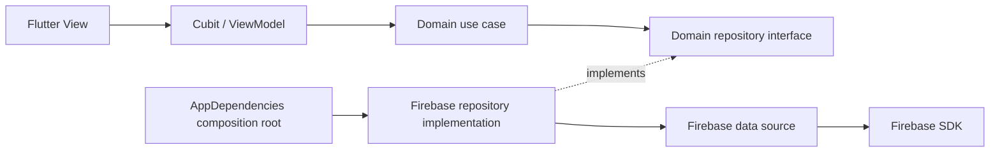

# Architecture and engineering decisions

The four core features (`auth`, `profile`, `orders`, `offers`) use real dependency
boundaries. The original screen layouts remain; the repository is not a new UI.

Static dependency direction: **presentation → domain ← data**. Runtime calls
reach Firebase through an injected implementation. The composition root in
`lib/app/dependencies.dart` is intentionally allowed to import both sides.

## Responsibilities

| Layer | Concrete example | Responsibility |
|---|---|---|
| View | `EditProfileScreen` | Controllers, image selection, rendering and navigation |
| ViewModel | `EditProfileCubit` | Loading/success/failure state and invoking operations |
| Use case | `UpdateProfile` | Validate meaningful editable fields |
| Domain contract | `ProfileRepository` | Describe operations without SDK types |
| Repository | `FirebaseProfileRepository` | Coordinate identity, storage and Firestore; map failures |
| Data source | `FirestoreProfilesDataSource` | Firestore document reads and updates |

**Single Responsibility:** widgets render and own their lifecycle; Cubits
coordinate presentation state; use cases validate application inputs; data sources
perform SDK operations. Profile editing controllers are initialized in `initState`
and disposed by the view rather than reset on state changes.

**Dependency Inversion:** use cases accept domain repository interfaces. Cubits
accept use cases through constructors. `RepositoryProvider` and `BlocProvider`
wire objects without a service locator or DI framework. Tests substitute
repositories or data sources without initializing Firebase.

**Repository Pattern:** repositories hide persistence and service coordination.
The profile repository updates only an explicit field patch. The offers repository
maps SDK exceptions to `AppFailure`; Firebase snapshots never cross into domain.

**Separation of Concerns:** Firebase imports are restricted to data/composition and
the notification transport. Authentication identity comes from the auth session,
not editable profile data or a cached UID. Views decide navigation and dialogs.

**MVVM-style presentation:** Cubits serve as ViewModels. They contain no Widgets,
BuildContext, Firebase calls or navigation. States are the view's observable model.
This is Bloc/Cubit-based MVVM-style presentation, not a claim of a separate
framework or academic implementation. Shell selection and language Cubits hold
only local UI state and do not need artificial use cases.

## Feature decisions

- **Auth:** exactly one sign-in operation per submission. Email verification gates
  the signed-in home; reset and verification emails are application operations.
  Registration creates an Auth account, then a profile, then sends verification.
  Profile failure attempts Auth rollback and never reports registration success.
  A failed rollback is an explicit support/recovery error. Verification delivery
  failure reports that the account exists and allows resend after sign-in.
- **Profile:** editable fields exclude UID, email, verification and `fcm`. Token
  registration uses a non-null token and Firestore array union. Photos are uploaded
  and their download URL is written to the profile; a failed photo step preserves
  successfully saved text and permits retry.
- **Orders:** required description/city/service and non-past ordered dates are
  checked before persistence. A document ID is allocated locally, then the complete
  payload is written once. Worker streams are canceled when their Cubit closes.
- **Offers:** submission checks order availability in a transaction. Acceptance
  reads order and offer in the same Firestore transaction, validates ownership,
  membership and eligibility, and atomically stores the accepted offer. On a retry,
  the guard sees the latest state. A later acceptance cannot overwrite an accepted
  offer through this implementation.

`completed` is the **legacy stored value for offer accepted**. `OrderStatus.accepted`
expresses that meaning in domain code. There is no implemented delivered-work
confirmation, payment settlement, cancellation or dispute lifecycle. Some original
tab labels still say completed for compatibility.

`order_view_data.dart` adapts typed entities to existing card maps to preserve the
layouts. Domain and repository APIs stay typed; replacing these remaining view
maps is optional follow-up work, not a missing data boundary.

## Failure and transaction limits

`AppFailure` is a small typed exception carrying a stable code and a user-facing
message. Repositories translate Firebase failures; Cubits turn them into failure
states. A sealed Result hierarchy was unnecessary for this project's size.

Auth, Storage and Firestore cannot share one transaction. Compensating registration
can still require manual repair during network failures; abandoned uploaded images
need a backend cleanup policy. A profile text update and photo update are separate
operations, with a visible failure if only part succeeds.

Client transaction guards do **not** replace server authorization. Reviewed Firestore
and Storage rules are required before exposing a live project. Current tests cover
policy and failure mapping, not emulator-level transaction contention or security
rule enforcement. Those remain documented integration work.

## Notifications

The client only receives messages and registers device tokens. The background
handler initializes Firebase and does not navigate. Foreground/opened notifications
are handed to the mounted home view. Legacy offer-ID payloads resolve through an
offers use case; newer payloads may carry `orderId` directly.

The persisted order transition and `OfferAcceptance` receipt form the backend
notification boundary. A future Cloud Function should observe committed changes,
authorize recipients, deduplicate by order/offer ID and send through Admin SDK.
Do not send notifications inside a retryable transaction callback. No outbound
sender, service account, server key or fake endpoint exists in the client.

## Remaining technical work

- Review Firestore/Storage rules, exposure of contact fields/device tokens, App Check,
  and emulator authorization tests before a live deployment.
- Add emulator-level transaction contention and real-device camera, calling and
  notification tests; current unit/widget tests do not cover those integrations.
- Auth/Firestore/Storage cannot share a transaction. Rare failed registration
  compensation and abandoned images can require backend or manual cleanup.
- Implement backend push delivery, token refresh and removal on logout.
- Some original mixed-language labels and view-data maps remain. The retained iOS,
  Web and desktop scaffolding has not been verified.
- Complete release signing, asset-license review and real screenshot capture.
  The Android baseline's NDK recommendation and style infos are documented in
  [Android baseline](android-baseline.md) and [verification](verification.md).

## Interview discussion prompts

1. Trace an Accept button tap through every layer to the Firestore transaction.
2. Explain why runtime calls reach data while domain imports never point to data.
3. Explain how the transaction handles concurrent acceptance attempts and why
   server rules are still necessary.
4. Distinguish authentication identity, editable profile data and session authority.
5. Describe compensation when signup succeeds but profile creation fails.
6. Explain why controllers, image picking and navigation belong to Views.
7. Explain why an update patch protects FCM tokens and other unrelated fields.
8. Discuss stream cancellation, disposal, loading states and duplicate submissions.
9. Explain the legacy `completed` mapping and how a future lifecycle migration
   could be made without corrupting existing documents.
10. Identify what unit/widget tests prove and what requires a Firebase emulator or device.
